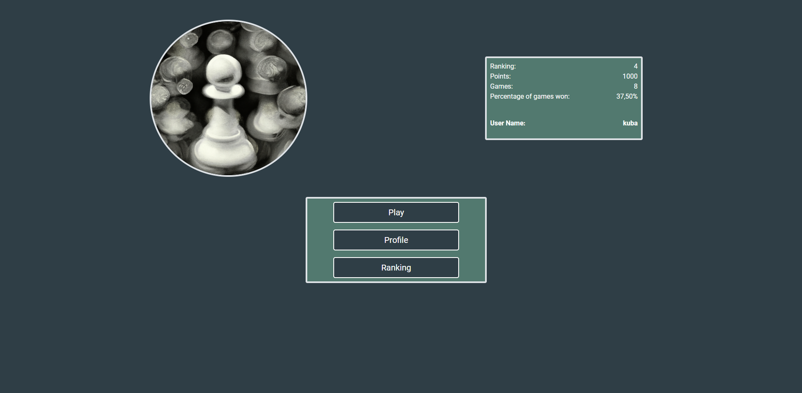
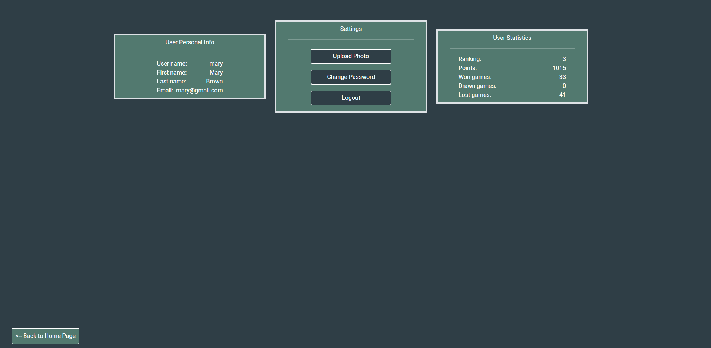
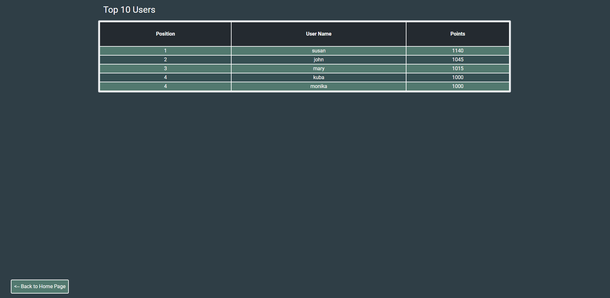
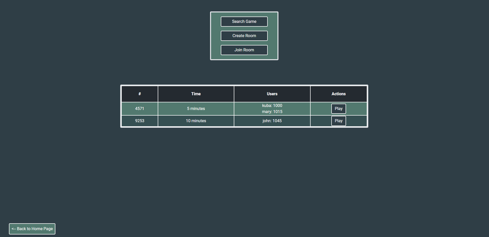
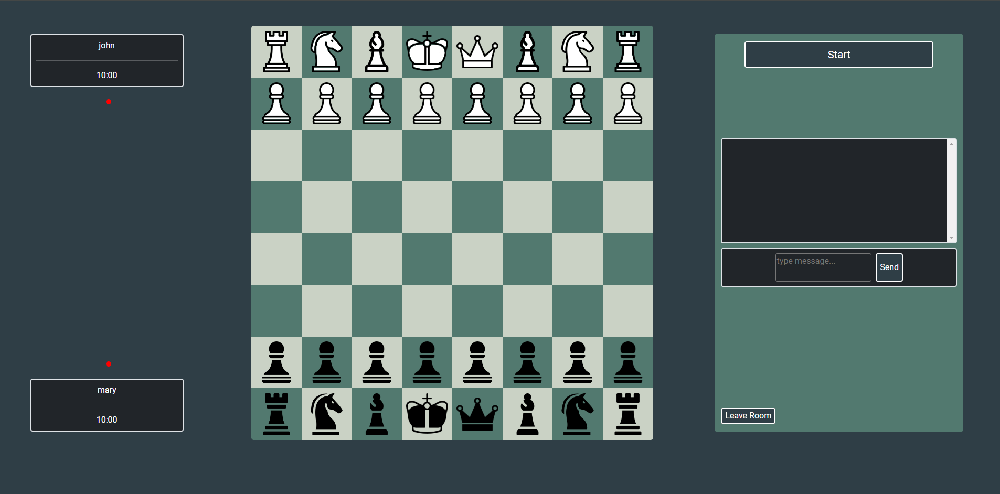
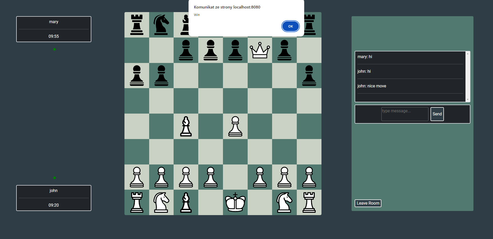
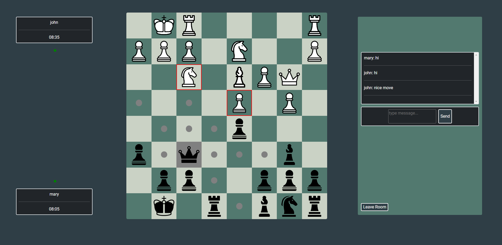

# WebChess
Web Application for chess players

## Description
Application requires creating an account to access its content. After log in user can create a room or join another room to play chess. After each game user's staistics are updated. 
Player can check his points and position in user ranking. Application analizes the state of game and sends only possible moves to frontend so user can easily search allowed moves. Backend renders pages and after receiving a http request sends them to user.
Backend is created in Spring Boot and connected with MySQL database from which it obtains data. 

## Game room
User can select the colour of pieces and duration of chess game when he creates the room. Then when the second user joins his room both users should click "start" button to begin the game.
Finally room starts the clock countdown and the users can move their pieces. During the game users are allowed to send messages to each other using chat in the room.

## Sample images from Web Application
|                                           |                                            |
| ----------------------------------------- |--------------------------------------------|
| |  |
| |  |

### Room images
|                                           |                                            |
| ----------------------------------------- |--------------------------------------------|
| |  |

### Possible moves after click queen
|                                           |
| ----------------------------------------- |
| |
